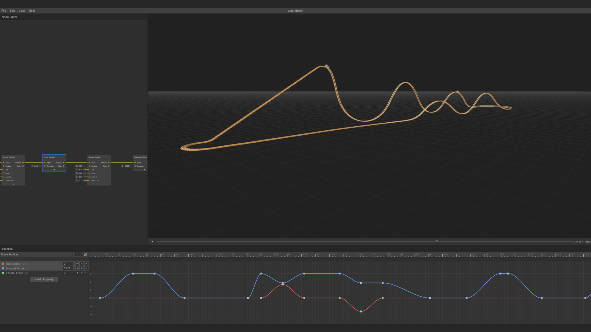

# KexEdit

KexEdit is an advanced roller coaster editor based on FVD (Force Vector Design).

## ⭐ Key Features

-   **Node Graph**: A modern node-based editor that allows complex track layouts.
-   **Timeline**: A dope sheet / curve timeline editor to control properties over time.
-   **High-performance**: Uses [Unity DOTS](https://unity.com/dots) and compute shaders for performant track computation and rendering.
-   **Export**: Save as `.kex` files or export in NoLimits 2-compatible format.
-   **Open-source**: Free for commercial and non-commercial use.

## 🚀 Installation

-   **Recommended:** Download from [itch.io](https://individualkex.itch.io/kexedit) or with the [itch.io app](https://itch.io/app) for automatic updates.
-   **Alternative:** Visit the [latest release](https://github.com/IndividualKex/KexEdit/releases/latest) page and follow the download and installation instructions.

_Note: Mac version only supports Apple Silicon and requires quarantine removal._

## 📖 Usage

-   For a quick introduction, see [this video](https://youtu.be/RRIkHtnoP18).
-   For detailed documentation, see the [official docs](https://individualkex.github.io/KexEdit/).

## 🔗 Links

-   **Discord**: [Join the community](https://discord.gg/eEY75Nqk3C)
-   **Documentation**: [Full user guide](https://individualkex.github.io/KexEdit/)
-   **itch.io**: [Download latest version](https://individualkex.itch.io/kexedit)
-   **Issues**: [Report bugs or request features](../../issues)

## Credits

-   [Standalone File Browser](https://github.com/gkngkc/UnityStandaloneFileBrowser) by Gökhan Gökçe (MIT License)

## License

Released under MIT License. Free for commercial and non-commercial use.

## Acknowledgments

-   [FVD++](https://github.com/altlenny/openFVD), [Newton](http://lucasbosch.de/nolimits-tools/?dir=newton) and other projects that pave the way for advanced roller coaster simulation.
