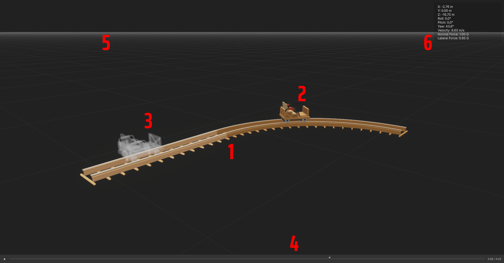

# Game View Reference

Real-time 3D preview with two camera modes: Orbit for overview navigation and Fly for free movement.

_Game View interface showing track, carts, and playback controls_

## Interface Elements

The Game View displays:

1. **Track** - Your roller coaster layout with real-time rendering
2. **Main Cart** - Solid cart showing current simulation time
3. **Playhead Cart** - Transparent cart indicating timeline playhead position (see [Timeline Reference](timeline.md))
4. **Playback Controls** - Play/pause, scrub bar, and time display
5. **Grid** - Ground alignment grid (toggle with `F2`)
6. **Stats Overlay** - Detailed simulation stats (toggle with `F3`)

## Camera Modes

### Orbit Mode (Default)

Camera rotates around a focus point, similar to Unity's Scene view.

| Input               | Action | Notes                              |
| ------------------- | ------ | ---------------------------------- |
| `Alt + Mouse Drag`  | Orbit  | Rotate camera around focus point   |
| `Middle Mouse Drag` | Pan    | Pan camera horizontally/vertically |
| `Alt + Right Drag`  | Pan    | Alternative pan control            |
| `Mouse Wheel`       | Zoom   | Zoom in/out toward cursor          |
| `F`                 | Focus  | Frame selected track sections      |

### Fly Mode (Free Look)

Free-flying camera for exploring your track, similar to game cameras.

| Input                | Action        | Notes                       |
| -------------------- | ------------- | --------------------------- |
| `Right Click + Hold` | Activate Fly  | Enter fly mode while held   |
| `+ Mouse Move`       | Look Around   | Rotate camera view          |
| `+ W/A/S/D`          | Move          | Forward/Left/Back/Right     |
| `+ Q/E`              | Move Up/Down  | Vertical movement           |
| `+ Shift`            | Fast Movement | 3x movement speed           |
| `+ Mouse Wheel`      | Adjust Speed  | Change fly speed multiplier |

## Selection

Click track sections to select them for editing or focus.

| Input           | Action       | Notes                    |
| --------------- | ------------ | ------------------------ |
| `Left Click`    | Select       | Select track section     |
| `Shift + Click` | Multi-Select | Add section to selection |
| `F`             | Focus        | Frame selected sections  |

**Note**: Selection only works when not using camera modifier keys (Alt, Right-click).

## Playback Controls

Timeline controls appear at the bottom of the Game View.

| Control           | Action     | Notes                      |
| ----------------- | ---------- | -------------------------- |
| Play/Pause Button | Play/Pause | Toggle simulation playback |
| Scrub Bar         | Seek       | Drag to scrub through time |
| Time Display      | Info       | Shows current/total time   |
| `Space`           | Play/Pause | Keyboard shortcut          |

### Ride Camera

| Input | Action           | Notes                        |
| ----- | ---------------- | ---------------------------- |
| `R`   | Toggle Ride View | First-person camera on track |

_Ride camera follows the cart along the track for rider's perspective._

## Display Options

### Overlays

| Input       | Action                 | Notes                         |
| ----------- | ---------------------- | ----------------------------- |
| `F1`        | Gizmos                 | Toggle track gizmos           |
| `F2`        | Grid                   | Toggle alignment grid         |
| `F3`        | Stats                  | Toggle simulation stats       |
| `F4`        | Node Grid Snapping     | Toggle node grid snapping     |
| `Ctrl + F1` | Velocity Visualization | Toggle velocity visualization |

---

[← Back to Documentation](../)
