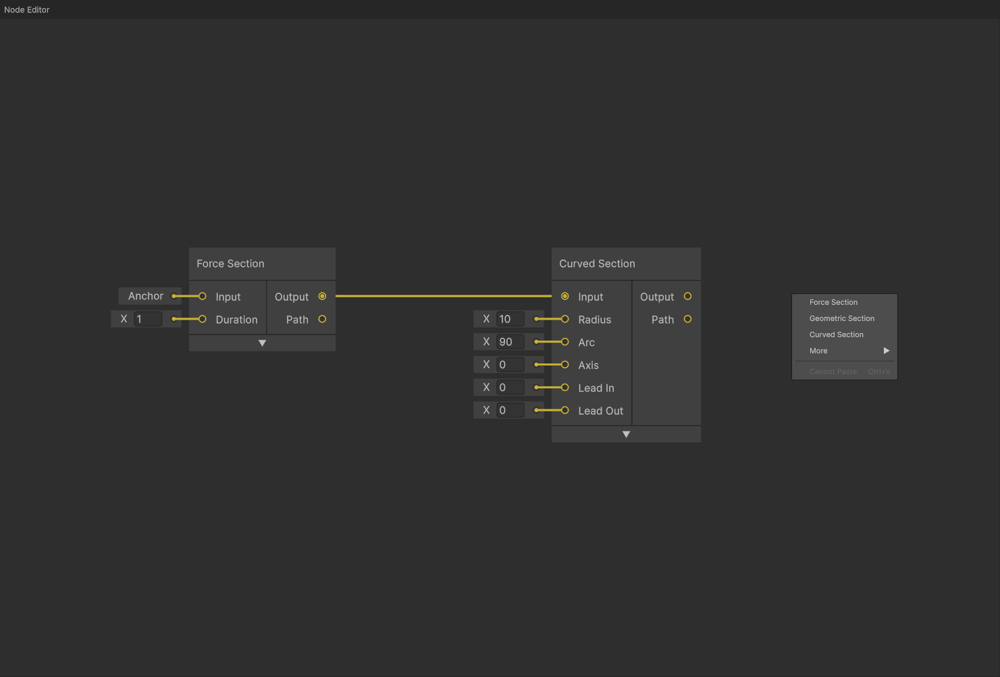

# Node Graph Reference

Visual node-based interface for building track layouts, similar to Unity Shader Graph or Blender nodes.

_Node Graph interface showing different node types, connections, and workflow_

## Interface Elements

The Node Graph displays:

1. **Track Section Nodes** - Core building blocks (Force, Geometric sections)
2. **Connection Line** - Data flow from one node to another
3. **Add Node Menu** - Right-click context menu for adding nodes

## Node Management

### Adding Nodes

| Method              | Action            | Notes                                  |
| ------------------- | ----------------- | -------------------------------------- |
| `Right Click`       | Context menu      | Add any node type at cursor            |
| `Drag from Output`  | Auto-connect      | Create and connect compatible node     |
| `Double-click Port` | Promote to Anchor | Convert input port to full Anchor node |

### Selection and Movement

| Input           | Action       | Notes                                   |
| --------------- | ------------ | --------------------------------------- |
| `Left Click`    | Select       | Select single node                      |
| `Shift + Click` | Multi-Select | Add to selection                        |
| `Ctrl+A`        | Select All   | Select all nodes                        |
| `Alt+A`         | Deselect All | Clear selection                         |
| `Drag`          | Move         | Reposition selected nodes with snapping |

_Note: To enable grid snapping, go to File → Preferences → Node Grid._

### Navigation

| Input               | Action | Notes                     |
| ------------------- | ------ | ------------------------- |
| `Middle Mouse Drag` | Pan    | Pan view around graph     |
| `Alt + Right Drag`  | Pan    | Alternative pan control   |
| `Mouse Wheel`       | Zoom   | Zoom in/out toward cursor |

## Node Types

### Track Sections

Generate actual track geometry and simulation data.

| Node Type             | Purpose                              | Inputs                    | Outputs      |
| --------------------- | ------------------------------------ | ------------------------- | ------------ |
| **Force Section**     | Apply specific forces (hills, loops) | Anchor, Duration          | Anchor, Path |
| **Geometric Section** | Control banking/orientation          | Anchor, Duration          | Anchor, Path |
| **Curved Section**    | Create curved track (turns, helixes) | Anchor, Radius, Arc, etc. | Anchor, Path |
| **Copy Path Section** | Duplicate existing track             | Anchor, Path              | Anchor, Path |
| **Bridge**            | Connect two anchors to close loops   | Anchor, Anchor            | Anchor, Path |

### Utility Nodes

Transform or process track data without generating geometry.

| Node Type        | Purpose                           | Inputs                      | Outputs |
| ---------------- | --------------------------------- | --------------------------- | ------- |
| **Anchor**       | All data for a single track point | Position, Roll, Pitch, etc. | Anchor  |
| **Reverse**      | Reverse train direction            | Anchor                      | Anchor  |
| **Reverse Path** | Reverse a generated track path    | Path                        | Path    |

All track section nodes have an expandable panel with the following options:

-   **Duration Type**: The argument used to define duration - either `Time` or `Distance` (if applicable)
-   **Render**: Whether to render the track section in the game view
-   **Priority**: The priority of the track section. One node can be connected to multiple other nodes, but the train will follow the highest priority path.

### Force Section

The core of Force Vector Design - a track section generated from the forces experienced by the rider.

Inputs:

-   **Anchor**: The anchor node defining the start of the track section
-   **Duration**: The duration of the track section

Outputs:

-   **Anchor**: The anchor node defining the end of the track section
-   **Path**: The full path of the track section

Force Sections enable controlling **Roll Speed**, **Normal Force**, and **Lateral Force** in the Timeline, in addition to optional overrides.

### Geometric Section

A section that controls the geometry of the track directly, instead of through forces.

Inputs:

-   **Anchor**: The anchor node defining the start of the track section
-   **Duration**: The duration of the track section

Outputs:

-   **Anchor**: The anchor node defining the end of the track section
-   **Path**: The full path of the track section

Geometric Sections enable controlling **Roll Speed**, **Pitch Speed**, and **Yaw Speed** in the Timeline, in addition to optional overrides.

**Steering Option**: Geometric sections have a **Steering** toggle that determines how yaw changes are calculated:
- **On (default)**: Yaw changes are global with respect to world up vector - the track turns relative to the world's vertical axis
- **Off**: Yaw changes are local with respect to the track's current up vector - the track turns relative to its own orientation

### Curved Section

A section used to create simple, precisely shaped curves.

Inputs:

-   **Anchor**: The anchor node defining the start of the track section
-   **Radius**: The inner radius of the curve in meters
-   **Arc**: The arc of the curve, or the total amount the curve will turn, in degrees
-   **Axis**: The axis of the curve, defined as degrees from the positive X axis. 0 degrees is a right turn, 90 degrees is an upward turn, 180 degrees is a left turn, and 270 degrees is a downward turn.
-   **Lead In**: Smoothly transition into the curve
-   **Lead Out**: Smoothly transition out of the curve

Outputs:

-   **Anchor**: The anchor node defining the end of the track section
-   **Path**: The full path of the track section

Curved Sections enable controlling **Roll Speed** in the Timeline, in addition to optional overrides.

### Copy Path Section

A section used to duplicate the shape of an existing track section. This only copies the shape of the original track, while forces will be calculated from the new anchor. This is typically most useful in combination with [Reverse](#reverse) nodes.

Inputs:

-   **Anchor**: The anchor node defining the start of the track section
-   **Path**: The path of the track section to copy
-   **Start**: Optional trimmed start time (0 for no trimming)
-   **End**: Optional trimmed end time (-1 for no trimming)

Outputs:

-   **Anchor**: The anchor node defining the end of the track section
-   **Path**: The full path of the track section

Copy Path Sections enable controlling optional overrides.

### Anchor Node

Complete data for a single track point.

Inputs:

-   **Position**: The position of the track point in world space
-   **Roll**: The roll of the track point in degrees
-   **Pitch**: The pitch of the track point in degrees
-   **Yaw**: The yaw of the track point in degrees
-   **Velocity**: The velocity of the track point in meters per second
-   **Heart**: The heart distance, or distance from the track to rider heart, in meters
-   **Friction**: A unitless friction constant
-   **Resistance**: Air resistance in inverse nanometers

Outputs:

-   **Anchor**: The anchor node itself

_Note: When a connected Anchor node is deleted, its information will remain stored in the connected node(s). To restore the deleted Anchor node, right-click on the Anchor input port and select "Promote to Anchor"._

### Bridge

A node used to connect two anchors with a simple Catmull-Rom spline. This is typically used to close circuits.

Inputs:

-   **Source Anchor**: The anchor node defining the start of the bridge
-   **Destination Anchor**: The anchor node defining the end of the bridge

Outputs:

-   **Anchor**: The anchor node defining the end of the bridge (equivalent to the **Destination Anchor**, but with recalculated velocity and forces)
-   **Path**: The full path of the bridge

Bridge nodes enable controlling optional overrides.

### Reverse

A node used to reverse the direction of a track section. This is typically used in combination with [Copy Path Section](#copy-path-section) nodes to simulate a shuttle rollback.

Inputs:

-   **Anchor**: The input anchor point data

Outputs:

-   **Anchor**: The reversed anchor point data

### Reverse Path

See [Reverse](#reverse).

Inputs:

-   **Path**: The input path data

Outputs:

-   **Path**: The reversed path data

### Asset Nodes

Visual reference assets that assist with track design and shaping.

| Node Type | Purpose                        | Inputs                    | Outputs |
| --------- | ------------------------------ | ------------------------- | ------- |
| **Mesh**  | Import 3D models for reference | Position, Rotation, Scale | None    |

### Mesh

Import external 3D models to use as visual reference when designing track layouts. Supports [glTF/GLB format](https://www.khronos.org/gltf/) files with basic PBR materials.

**Adding a Mesh:**

1. Right-click in the Node Graph
2. Select **More → Mesh**
3. Choose a `.gltf` or `.glb` file from the file dialog

**Relinking a Mesh:**

If the source file is moved or deleted, relink the mesh by right-clicking the mesh node and selecting **Link**, then choose a new file.

**Limitations:**

-   Supports basic PBR materials only (no advanced features)
-   Intended for track shaping assistance, not detailed theming or export
-   Files are referenced by path, not embedded in project

_Note: Mesh nodes are only for visual reference and do not affect track simulation or export._

---

[← Back to Documentation](../)
