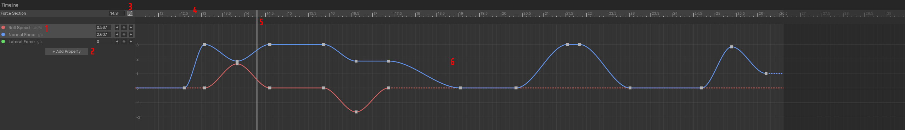

# Timeline Reference

Animation system for controlling track properties over time or distance.

_Timeline interface showing properties, keyframes, and curve editing_

## Interface Elements

When a node with controllable properties is selected, the Timeline displays:

1. **Properties** - List of controllable properties
2. **Add Property Button** - Add an optional override property
3. **Toggle Curve View Button** - Switch between dope sheet and curve editor
4. **Ruler** - Time (s) or distance (m), depending on the node's duration type (`Time` or `Distance`)
5. **Playhead** - Current position indicator, also shown as a transparent cart in the [Game View](game-view.md)
6. **Dope Sheet/Curve View** - Keyframe editing area

## Timeline Controls

### Navigation

| Input               | Action | Notes                              |
| ------------------- | ------ | ---------------------------------- |
| `Ruler`             | Seek   | Drag on ruler to set playhead time |
| `Middle Mouse Drag` | Pan    | Pan timeline view                  |
| `Mouse Wheel`       | Zoom   | Zoom in/out on timeline            |

### Property Controls

| Input                            | Action           | Notes                                   |
| -------------------------------- | ---------------- | --------------------------------------- |
| `Left Click`                     | Select           | Select property track                   |
| `Shift + Click`                  | Multi-Select     | Add property to selection               |
| `Set Keyframe Button`            | Set Keyframe     | Add or update keyframe at playhead time |
| `Jump to Next/Previous Keyframe` | Jump to Keyframe | Jump playhead to next/previous keyframe |

### View Controls

| Input                           | Action              | Notes                                                    |
| ------------------------------- | ------------------- | -------------------------------------------------------- |
| `Toggle Curve View Button`      | Switch View Mode    | Toggle between dope sheet and curve editor               |
| `Eye Icon (Curve View)`         | Toggle Visibility   | Show/hide individual property curves in curve view       |
| `Right-click Toggle Curve View` | Curve Visualization | Enable/disable read-only curve display (legacy behavior) |

## Keyframe Editing

### Basic Operations

| Input           | Action       | Notes                                    |
| --------------- | ------------ | ---------------------------------------- |
| `I`             | Insert       | Add keyframe at playhead                 |
| `Left Click`    | Select       | Select keyframe                          |
| `Double Click`  | Edit         | Toggle keyframe edit panel               |
| `V`             | Set Value    | Quick value editor for selected keyframe |
| `Shift + Click` | Multi-Select | Add to selection                         |
| `Drag`          | Move         | Reposition keyframe                      |
| `Delete`        | Remove       | Delete selected keyframes                |
| `Ctrl+C/V`      | Copy/Paste   | Duplicate keyframes                      |
| `Box Select`    | Multi-Select | Drag to select multiple                  |
| `Right Click`   | Context Menu | Edit, Optimize, etc.                     |

### Curve View Controls

| Input                | Action           | Notes                                   |
| -------------------- | ---------------- | --------------------------------------- |
| `Drag Bezier Handle` | Adjust Curve     | Fine-tune curve shape and easing        |
| `Shift + Drag`       | Constrain Motion | Lock to horizontal or vertical movement |
| `Double Click`       | Detailed Edit    | Toggle keyframe edit panel              |

## Keyframe Edit Dialog

Double-clicking a keyframe opens a detailed editor with advanced options:

### Properties

-   **Time/Distance**: Precise keyframe position
-   **Value**: Exact property value with units
-   **Interpolation**: Choose between Constant, Linear, and Bezier

### Easing Presets (Bezier only)

-   **Sine**: Gentle acceleration/deceleration
-   **Quadratic**: Moderate ease-in/out
-   **Cubic**: Standard animation easing
-   **Quartic**: Strong ease-in/out
-   **Quintic**: Very strong ease-in/out
-   **Exponential**: Sharp acceleration curves

### Manual Bezier Controls

-   **In/Out Weights**: Control handle length (0.0 to 1.0)
-   **In/Out Tangents**: Control handle angle (-∞ to +∞)
-   **Auto-detection**: Shows current easing type if it matches a preset

## Animation Properties

### Interpolation Types

| Type            | Description             | Visual                                          | Keyframe Shape |
| --------------- | ----------------------- | ----------------------------------------------- | -------------- |
| **Constant**    | Step changes            | Flat line segments                              | Square         |
| **Linear**      | Straight transitions    | Straight line slopes                            | Diamond        |
| **Bezier**      | Smooth curves           | Curved transitions with interactive handles     | Circle         |
| **Auto Bezier** | (Default) Smooth curves | Curved transitions with mirrored Bézier handles | Circle         |

### View Modes

#### Dope Sheet View

-   **Row-based layout**: Each property occupies a horizontal row
-   **Time-focused editing**: Primarily for timing adjustments
-   **Compact display**: Shows many properties at once
-   **Keyframe shapes**: Different shapes indicate interpolation type

#### Curve View

-   **Graph-based layout**: Properties displayed as curves on a value/time graph
-   **Precise curve editing**: Direct manipulation of bezier handles
-   **Visual curve shapes**: See the actual animation curves
-   **Individual visibility**: Toggle curves on/off with eye icons
-   **Value-focused editing**: Fine-tune animation curves and easing

## Property Types

### Node Properties (Node-dependent)

| Property          | Description           | Node Types                       | Units   |
| ----------------- | --------------------- | -------------------------------- | ------- |
| **Roll Speed**    | Banking rate          | Force, Geometric, Curved, Bridge | rad/sec |
| **Normal Force**  | Vertical G-force      | Force                            | G       |
| **Lateral Force** | Horizontal G-force    | Force                            | G       |
| **Pitch Speed**   | Up/down rotation rate | Geometric                        | rad/sec |
| **Yaw Speed**     | Left/right turn rate  | Geometric                        | rad/sec |

### Override Properties (All nodes)

These optional properties have no effect unless added. For example, adding the `Fixed Velocity` property overrides the cart's velocity, even with no keyframes. Otherwise, velocity is physically simulated.

| Property           | Description      | Units |
| ------------------ | ---------------- | ----- |
| **Fixed Velocity** | Override speed   | m/s   |
| **Heart**          | Heartline offset | m     |
| **Friction**       | Surface friction | -     |
| **Resistance**     | Air resistance   | μm⁻¹  |

_Note: Property values automatically carry forward between connected sections. For example, pitch curvature created in a Force Section will carry over to the default pitch speed of a following Geometric Section. To reset a property to its inherited value, right-click the keyframe and select **Reset**._

---

[← Back to Documentation](../)
