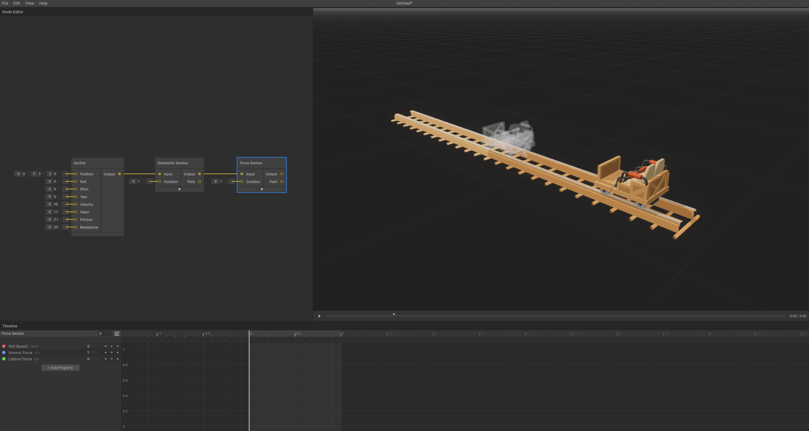

Create your first track with connected sections and test the ride.

_Simple track with Anchor, Geometric Section, and Force Section connected_

## Creating Your First Track

### 1. Add a Geometric Section

-   **Right-click** in the Node Graph
-   Select **Geometric Section** from the menu
-   Press **F** to focus on the new node

### 2. Create a Starting Point

-   **Double-click** the Anchor input port (left side of node)
-   This creates an **Anchor Node** with the starting track point
-   Adjust the **Position**, **Pitch**, and **Velocity** values as needed

### 3. Add a Force Section

**Method 1**: Manual connection

-   Right-click → **Force Section**
-   **Drag** from Geometric Section output to Force Section input

**Method 2**: Auto-connect (recommended)

-   **Drag** from Geometric Section output port
-   Select **Force Section** from the context menu
-   New node automatically connects

### 4. Test Your Track

-   **Space** - Play/pause the simulation
-   **R** - Toggle ride camera for first-person view
-   **Scrub bar** - Drag to move through time manually

## Navigation Controls

### Game View (3D)

-   **Right-click + WASD** - Fly camera mode
-   **Alt + Mouse Drag** - Orbit around track
-   **F** - Focus on selected sections

### Node Graph

-   **Middle Mouse Drag** - Pan view
-   **Mouse Wheel** - Zoom in/out
-   **F** - Frame selected nodes

---

**Next**: [Getting Started - Controlling Properties](controlling-properties.md)

---

[← Back to Documentation](../)
