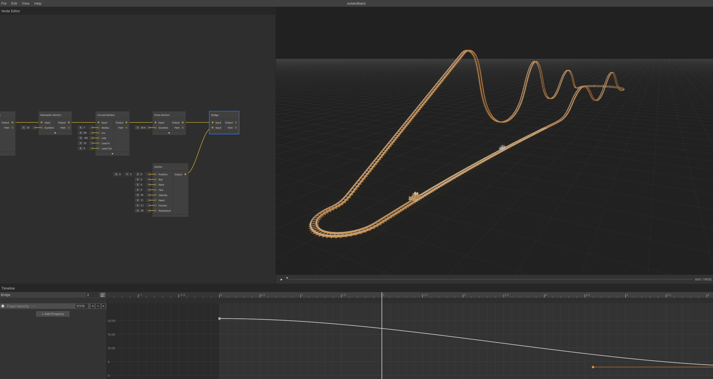

# Complete Circuits

Use Bridge nodes to connect track ends and create closed loop coasters.

_Bridge node connecting the end of a track back to the starting station_

## Bridge Node Purpose

**Bridge nodes** connect two anchor points with a smooth spline, typically used to close circuits by linking the track end back to the station.

**Path Type**: Simple Catmull-Rom spline between the two connection points.

## Creating a Complete Circuit

Close your track loop by bridging the final section back to the start.

### Setup

1. **Build Your Track** - Create sections that end near the starting position
2. **Copy Start Anchor** - Copy and paste the anchor node from the beginning
3. **Position Anchors** - Place the copied anchor near your track's end point

### Connect with Bridge

1. **Add Bridge Node** - Right-click → **Bridge**
2. **Connect Track End** - Drag from final section output to Bridge's first input
3. **Connect Start Point** - Drag from copied anchor output to Bridge's second input

### Result

The Bridge automatically creates a smooth connection between the two points, completing your circuit.

## Bridge Connections

| Input                  | Connection         | Purpose                   |
| ---------------------- | ------------------ | ------------------------- |
| **Source Anchor**      | Track end output   | Where the bridge begins   |
| **Destination Anchor** | Start point anchor | Where the bridge connects |

## Usage Notes

-   **Positioning**: Place anchors close together for smoother connections
-   **Simple Path**: Bridge uses basic spline - complex connections may need manual sections
-   **Circuit Completion**: Enables continuous operation for full coaster circuits

---

**Next**: [Advanced Techniques - Shuttle Coasters](shuttle-coasters.md)

---

[← Back to Documentation](../)
