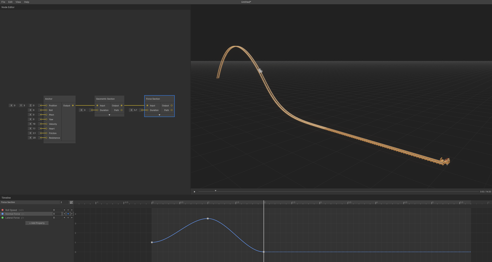

Use timeline properties to create dynamic track elements like launches and hills.

_Launch and hill created with timeline properties_

## Creating a Launch (Velocity Control)

Add smooth acceleration to your track with velocity overrides.

### Setup Launch Section

1. **Select** the Geometric Section node
2. **Timeline Outliner** shows available properties on the left
3. **Add Property** → **Fixed Velocity**
4. **Increase Duration** - Drag ruler end or adjust node input

### Add Velocity Keyframes

1. **Set Starting Speed** - Click keyframe button, enter `0.1` m/s at time 0
2. **Set Launch Speed** - Add keyframe near section end with `30` m/s
3. **View Curve** - Toggle Curve View button to see acceleration curve

## Creating a Hill (Normal Force Control)

Shape track elevation using normal force values.

### Setup Hill Section

1. **Select** the Force Section node
2. **Increase Duration** as needed

### Add Force Keyframes

| Time | Normal Force | Effect                           |
| ---- | ------------ | -------------------------------- |
| 0s   | Default      | Transition from previous section |
| 1s   | 3.5G         | Pull up (creates hill)           |
| 2s   | 0G           | Weightless (airtime)             |

### Result

Creates a hill with airtime - riders experience strong downward force, then weightlessness.

_Note: Property values automatically carry forward between connected sections. For example, pitch curvature created in a Force Section will carry over to the default pitch speed of a following Geometric Section. To reset a property to its inherited value, right-click the keyframe and select **Reset**._

---

**Next**: [Getting Started - Lift Hill](lift-hill.md)

---

[← Back to Documentation](../)
