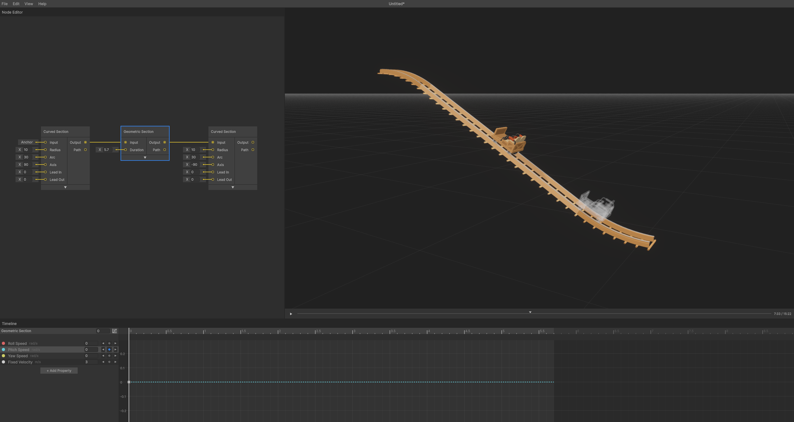

# Lift Hill

Create a simple chain lift hill with curved sections and a straight geometric section.

_Complete lift hill setup with bottom curve, straight lift section, and top curve_

## Creating a Lift Hill

### Bottom Curve Transition

Create the entry transition that curves upward into the lift.

1. **Add Curved Section** - Right-click → **Curved Section**
2. **Set Upward Direction** - Change **Axis** to `90` (curves up instead of right)
3. **Set Incline Angle** - Lower **Arc** to `30` for a 30-degree incline
4. **Add Velocity Control** - Timeline → **Add Property** → **Fixed Velocity**
5. **Set Lift Speed** - Add keyframe with desired velocity (e.g. `3 m/s`)

### Straight Lift Section

Build the main inclined section with consistent speed and pitch.

1. **Connect Geometric Section** - Drag from curved section output to new **Geometric Section**
2. **Maintain Speed** - Add **Fixed Velocity** property (inherits previous `3 m/s` value)
3. **Extend Duration** - Increase section length to desired lift hill height

### Top Curve Transition

Complete the lift with a downward transition curve.

1. **Connect Curved Section** - Drag from geometric section output to new **Curved Section**
2. **Set Downward Direction** - Change **Axis** to `-90` (curves down)
3. **Match Angle** - Set **Arc** to `30` degrees
4. **Continue Speed Control** - Add **Fixed Velocity** property

## Usage Tips

1. If the geometric section isn't straight, ensure **Roll Speed**, **Pitch Speed**, and **Yaw Speed** are `0 rad/s`, adding keyframes if necessary.
2. If the track isn't being generated, make sure each section has a **Fixed Velocity** property.

---

**Next**: [Advanced Techniques - Complete Circuits](complete-circuits.md)

---

[← Back to Documentation](../)
