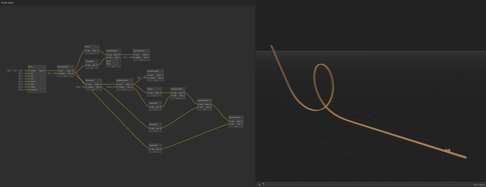

# Shuttle Coasters

Create realistic shuttle coasters with rollbacks using modular path manipulation nodes.

_Shuttle coaster with rollback created using Reverse, Reverse Path, and Copy Path nodes_

## Basic Shuttle Rollback

Use path manipulation nodes to simulate realistic rollback behavior.

### Create Forward Track

1. **Build Layout** - Create your desired track using Geometric Sections
2. **Set Distance Duration** - Use distance-based duration, extend until velocity reaches 0
3. **Result** - Train naturally slows and stops at the end

### Add Rollback Path

1. **Add Reverse Node** - Connect Anchor output to Reverse node
2. **Add Reverse Path Node** - Connect Path output to Reverse Path node
3. **Add Copy Path Node** - Connect both reversed outputs to Copy Path inputs
4. **Disable Rendering** - Turn off Copy Path rendering to avoid visual artifacts

### Result

The train follows the forward path, stops, then follows the reversed path backward with accurate physics.

## Bonus: Vertical Spike

Add a vertical spike that the train doesn't follow but affects the track shape.

### Create Spike Section

1. **Add Geometric Section** - Connect to end of main track
2. **Set Fixed Velocity** - Necessary for non-zero velocity
3. **Extend Duration** - Controls spike length
4. **Lower Priority** - Set to -1 so train ignores this branch

### Complete Shuttle

1. **Mirror All Sections** - Use Copy Path nodes for each previous section
2. **Reverse Path Outputs** - Connect through Reverse Path nodes
3. **Result** - Full shuttle with spike and accurate backward forces

---

**Next**: [Advanced Techniques - Custom Track Styles](custom-track-styles.md)

---

[← Back to Documentation](../)
